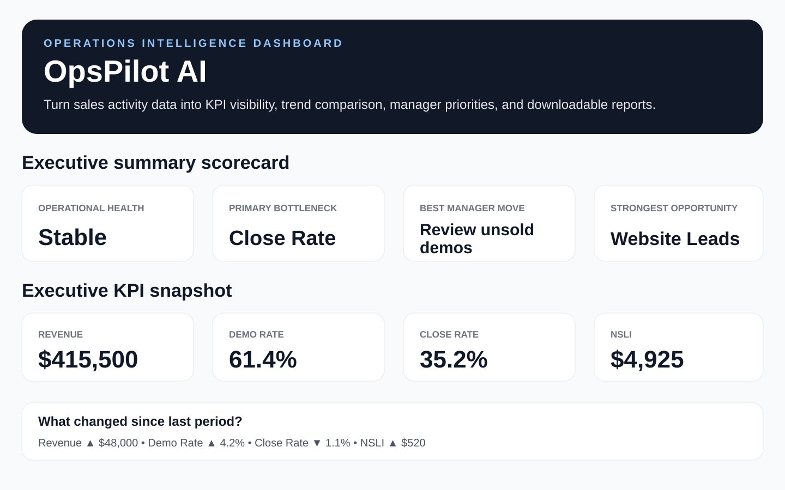

# OpsPilot AI

OpsPilot AI is an operations intelligence dashboard for field-sales and home-service teams. It converts daily sales activity into KPI reporting, rep performance insights, lead source analysis, trend visibility, coaching priorities, and manager-ready action plans.

## Live Demo

[Launch OpsPilot AI](https://opspilot-ai.streamlit.app/)

## Why this project exists

Small and mid-sized businesses often rely on scattered spreadsheets, CRM exports, daily reports, and manager notes to make operational decisions. OpsPilot AI gives operators a simple way to identify what is working, what needs attention, and what actions should happen next.

The goal is to help small and mid-sized businesses make faster, cleaner, data-driven decisions without needing enterprise-level RevOps software.

## Who this helps

OpsPilot AI is designed for:

- Home-service companies
- Field-sales teams
- Sales managers and operations leaders
- Small business owners who need better visibility
- Teams that manage leads, demos, sales activity, revenue, and follow-up performance

## Current Version: v2.3

OpsPilot AI v2.3 includes:

- Editable sample CSV download
- Public-safe fictional sample data
- CSV upload workflow
- Data readiness check
- Adjustable KPI targets
- Executive Summary Scorecard
- Operational health status
- Primary bottleneck detection
- Best manager move recommendation
- Period-over-period trend comparison
- Executive KPI snapshot
- Rep performance analysis
- Lead source performance analysis
- AI-style operations diagnosis
- Top 3 manager priorities
- Rep coaching cards
- Manager brief
- Weekly sales meeting agenda
- Downloadable manager report
- Downloadable filtered data CSV

## What it analyzes

The dashboard calculates and evaluates:

- Leads issued
- Demos
- Sales
- Revenue
- Demo rate
- Close rate
- Average sale
- Net sales per lead issued (NSLI)
- Rep performance
- Lead source performance
- Performance trends over time
- Coaching opportunities
- Manager action priorities

## Required CSV Format

Users can download the editable sample CSV, replace the fictional data with their own activity data, and re-upload it.

Required columns:

```csv
Date,Rep,Lead Source,Leads Issued,Demos,Sales,Revenue
```

Example row:

```csv
2026-01-05,Alex Carter,Website,10,7,3,42000
```

## Manager Outputs

OpsPilot AI generates manager-ready outputs, including:

- Executive summary scorecard
- Top 3 manager priorities
- Rep coaching cards
- Executive manager brief
- Weekly sales meeting agenda
- Downloadable Markdown manager report
- Filtered CSV export based on current dashboard filters

## Suggested Test Flow

1. Launch the live demo.
2. Download the sample CSV from the app.
3. Re-upload the sample CSV or use the built-in sample workflow.
4. Review the executive scorecard, KPI snapshot, operational health grade, and trend comparison.
5. Review rep performance and lead source performance.
6. Review the AI-style operations diagnosis and manager priorities.
7. Download the manager report.

## Screenshots

### Executive Scorecard and KPI Snapshot



## Tech Stack

- Python
- Streamlit
- Pandas
- GitHub
- Streamlit Community Cloud
- CSV-based workflow
- Markdown report export

## Run Locally

```bash
py -m pip install -r requirements.txt
py -m streamlit run app.py
```

## Public Demo Note

All sample data, names, companies, and scenarios used in this project are fictional and created for public portfolio demonstration purposes.

## Portfolio Purpose

This project was built as part of Bradley Hankins' AI operations and workflow automation portfolio.

OpsPilot AI demonstrates how practical AI-assisted tools can help small and mid-sized businesses improve visibility, coaching discipline, lead source analysis, manager reporting, and revenue operations workflows.

## Case Study

### Problem

Small and mid-sized businesses often have sales activity data, but the information is scattered across spreadsheets, daily reports, CRM exports, and manager notes. This makes it harder to identify bottlenecks, coach reps, and decide what should happen next.

### Solution

OpsPilot AI converts sales activity data into a manager-ready operations dashboard with KPI visibility, trend analysis, rep performance, lead source performance, AI-style operational diagnosis, manager priorities, a meeting agenda, and downloadable reports.

### My Role

I designed and built this project from concept to deployment, including:

- Defining the operations reporting workflow
- Designing the CSV input structure
- Building the Streamlit dashboard
- Writing the KPI and diagnostic logic
- Creating manager-ready summaries and reports
- Preparing fictional sample data for public portfolio use
- Publishing the project on GitHub
- Deploying the live demo

### Business Value

OpsPilot AI helps managers move from raw activity data to practical action. It can support faster performance reviews, better coaching conversations, cleaner meeting preparation, and stronger lead source visibility.

### Future Improvements

Planned future improvements include:

- Additional chart views
- PDF export options
- Multi-file upload workflows
- Team-level comparison dashboards
- Optional OpenAI API integration for dynamic manager insights

## Built By

Bradley Hankins  
Operations & Revenue Leader | AI Workflow Automation | RevOps & Process Improvement
