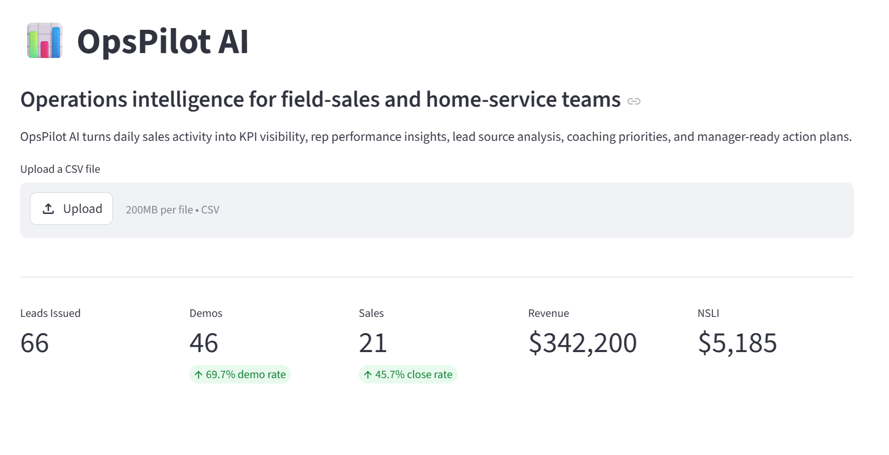
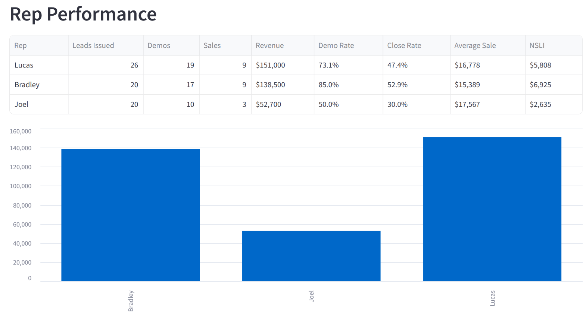
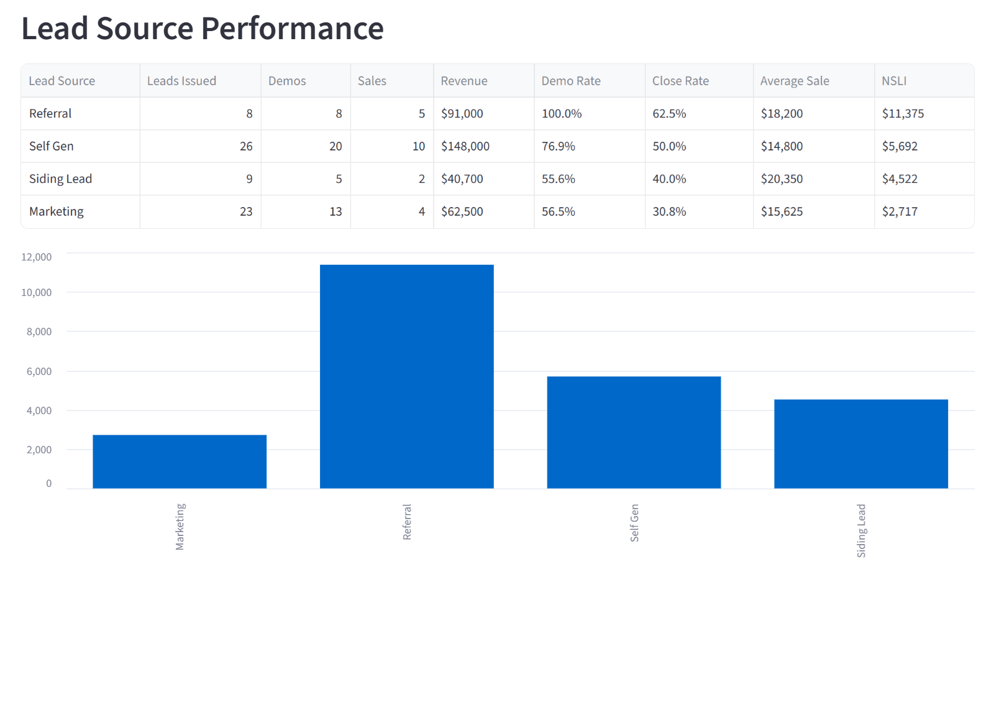
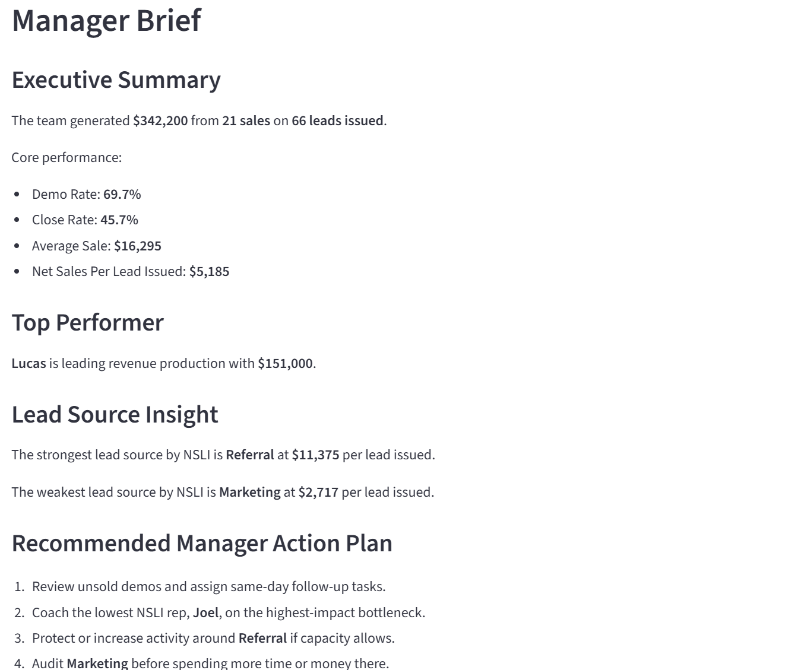
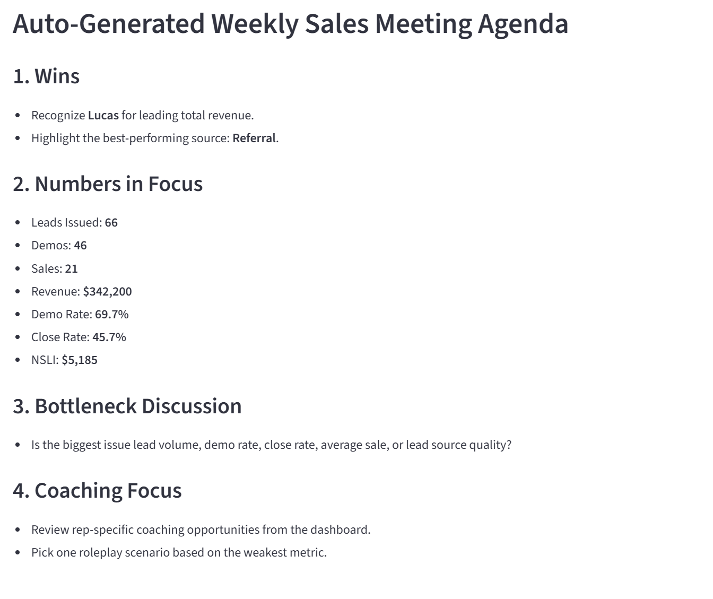

# OpsPilot AI

OpsPilot AI is an operations intelligence dashboard for field-sales and home-service teams. It converts daily sales activity into KPI reporting, rep performance insights, lead source analysis, coaching opportunities, and manager-ready action plans.

## Why this project exists

Small and mid-sized businesses often rely on scattered spreadsheets, CRM exports, daily reports, and manager notes to make operational decisions. OpsPilot AI gives operators a simple way to identify what is working, what needs attention, and what actions should happen next.

## Project Impact

OpsPilot AI was built to solve a common operations problem in field-sales and home-service businesses: managers often have activity data, but not a clear action plan.

This dashboard converts raw sales activity into usable operational intelligence, helping leaders quickly identify:

- Which reps are producing
- Which lead sources are worth protecting
- Where sales execution is breaking down
- What coaching conversations need to happen next
- What should be discussed in the next sales meeting

The goal is to help small and mid-sized businesses make faster, cleaner, data-driven decisions without needing enterprise-level RevOps software.

## Who this helps

OpsPilot AI is designed for:

- Home-service companies
- Field-sales teams
- Roofing, siding, gutter, HVAC, pest, and exterior remodeling businesses
- Sales managers and operations leaders
- Small business owners who need better visibility without enterprise software

## What it does

The dashboard helps users:

- Upload daily sales activity data
- Track leads issued, demos, sales, revenue, close rate, demo rate, average sale, and NSLI
- Compare rep performance
- Compare lead source quality
- Identify operational health risks
- Generate coaching opportunities
- Create a manager-ready brief
- Build a weekly sales meeting agenda
- Generate an AI-style operations diagnosis that identifies the primary bottleneck, likely cause, manager action, coaching move, and roleplay scenario

## Screenshots

### KPI Dashboard

### Rep Performance

### Lead Source Performance

### Manager Brief

### Weekly Sales Meeting Agenda

### AI Operations Diagnosis

## Live Demo

[Launch OpsPilot AI](https://opspilot-ai-gyywegvqlyuavvanh6dnwq.streamlit.app/)

## Tech Stack

- Python
- Streamlit
- Pandas
- GitHub
- CSV-based data workflow

## Core Business Logic

OpsPilot AI calculates and analyzes:

- Leads issued
- Demos
- Sales
- Revenue
- Demo rate
- Close rate
- Average sale
- Net sales per lead issued
- Rep performance
- Lead source performance
- Coaching opportunities
- Manager action plans

## AI Operations Diagnosis

OpsPilot AI includes a rules-based AI-style diagnosis engine that translates KPI performance into practical management recommendations.

The diagnosis engine identifies:

- Primary operational bottleneck
- Priority level
- Likely cause
- Recommended manager action
- Recommended coaching move
- Suggested sales meeting roleplay
- Strongest rep
- Rep needing review
- Strongest lead source
- Lead source needing review

This allows managers to move beyond static reporting and quickly understand what action should happen next.